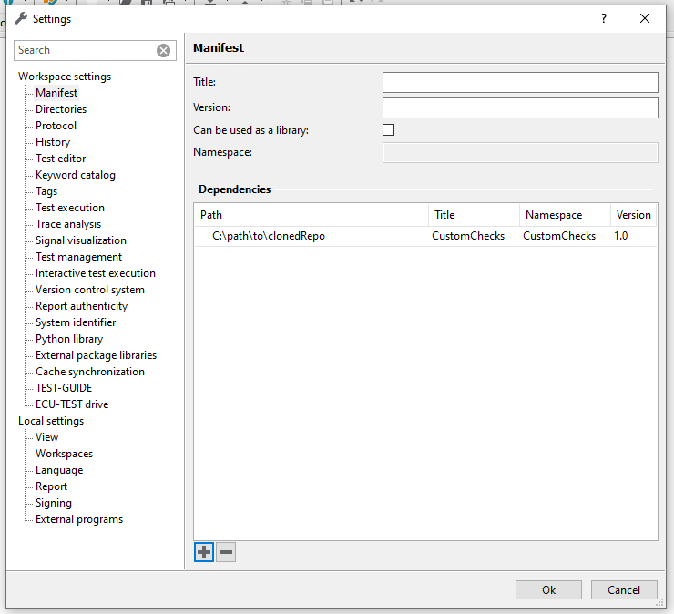
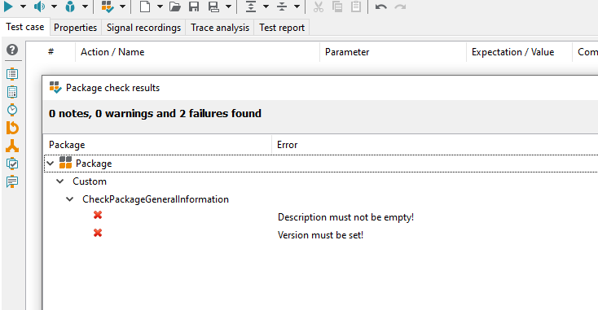

<!-- 
Copyright (C) 2023 TraceTronic GmbH

SPDX-License-Identifier: MIT
-->

# TraceTronic CustomChecks

[](https://www.tracetronic.com/products/ecu-test/) [](./LICENSE) [](https://github.com/tracetronic/ecu-test_custom-checks/releases) [](https://github.com/tracetronic/ecu-test_custom-checks/actions/workflows/reuse.yml)

The CustomChecks project implements checks for packages and projects that can be provided individually as UserPyModules and thus extend the Built-In-Checks that are delivered directly with [ECU-TEST](https://www.tracetronic.com/products/ecu-test/). All checks are available as open source and can be used as a basis for project specific CustomChecks.

 

ECU-TEST is a test automation software for the validation of embedded systems in automotive environments developed by
TraceTronic GmbH.<br/>
This software executes regression tests which are essential for validating complex technical products such as electronic
control units (ECUs).<br/>
It supports standardized access to a broad range of test tools and provides automation of distributed test
environments (SiL – MiL – HiL – vehicle).<br><br>


The **TraceTronic CustomChecks** project is part of
the [Automotive DevOps Platform](https://www.tracetronic.com/products/automotive-devops-platform/) by TraceTronic. With
the **Automotive DevOps Platform**, we go from the big picture to the details and unite all phases of vehicle software
testing – from planning the test scopes to summarizing the test results. At the same time, continuous monitoring across
all test phases always provides an overview of all activities – even with several thousand test executions per day and
in different test environments.<br><br>

Please consider other open-source solutions by [TraceTronic](https://github.com/tracetronic?type=source),
especially the [ECU-TEST Execution Plugin](https://github.com/jenkinsci/ecu-test-execution-plugin) and the
[CX Templates](https://github.com/tracetronic/cx-templates).

## Table of Contents

- [Getting Started](#getting-started)
  - [Installation](#installation)
  - [First Check Run](#first-check-run)
- [Usage](#usage)
  - [Features](#features)
  - [Configuration](#configuration)
  - [Workflows](#workflows)
- [Customization and Extension](#customization-and-extension)
- [Contribution](#contribution)
- [Support](#support)
- [License](#license)

## Getting Started

### Installation

The __recommended way__ to install the CustomChecks for ECU-TEST is by putting it into a _library workspace_, ensuring maximum
flexibility.

1. Clone this repository
2. Add the path to the cloned repository to the Manifest:

<br clear="left" />

You should now be able to use the CustomChecks (see [First Check Run](#first-check-run)). Note that, upon first execution, the
[configuration file](UserPyModules/CustomChecks/config_template.yaml) will be copied into the _Parameters/CustomChecks_ folder of your main
ECU-TEST workspace. 

You can change the namespace and the name of the CustomChecks library within ECU-TEST by modifying the [manifest](.workspace/manifest.xml)
file.

#### Alternative Installation

Alternatively, you can put the __CustomChecks__ folders under [UserPyModules](./UserPyModules) and *Parameters* into 
the respective folders in your main ECU-TEST workspace. If ECU-TEST was already running, press `Ctrl + Shift + R` to reload the UserPyModules.

### First Check Run

Create an empty ECU-TEST package and click on the check button:

<br clear="left" />

A notification box should appear: 

<br clear="left" />

Congratulations, you just completed your first check run successfully. :smiley:

## Usage

The CustomChecks consist of two major parts:
* the implementation scripts for the checks (under the [UserPyModules](./UserPyModules/CustomChecks) folder) determining what should be checked - these always start with _Check..._
* a [configuration file](./UserPyModules/CustomChecks/config_template.yaml) with which you control if and how the checks are executed

For a customized usage of the delivered checks, you need to adjust the [configuration file](./UserPyModules/CustomChecks/config_template.yaml) according to your needs.
The configuration file will be copied to *Parameters/CustomChecks/config.yaml* __in the main workspace__ when first executing the CustomChecks.
For a simple usage, this is basically the only thing you need to customize. For more involved features (such as writing your own checks), 
see [Customization and Extension](#customization-and-extension). You can automate the checks using the ECU-TEST REST-API
and COM-API, see [Workflows](#workflows).

### Features

With CustomChecks, you can check both ECU-TEST *Packages* and *Projects*. This repository contains checks for
* __package attributes__
  * desired attribute is set
  * attribute value follows regex pattern
  * attribute value is one of a limited set of choices
* __project attributes__ (similar to package attributes)
* __general information__ about the package, such as description length and existence of required parameters
* __package name__
  * with specified regex pattern
* __package variables__
  * variable name follows regex pattern
* allowed and disallowed __package content__ (such as test steps)

Further features:
* enable/disable certain checks completely
* specify the message which should be printed if a check fails
* set conditions to determine when a check should be executed  
* [define your own checks](#customization-and-extension) with your own custom configuration options, or extend existing ones

### Configuration

The [configuration](./UserPyModules/CustomChecks/config_template.yaml) determines the specifics of the check executions. A configuration item for one
specific check has the following structure:

```yaml
<CheckName>:
    Enabled: <true/false>
    <PackageType>
        Conditions:
            <PackageFeature>
                <Key>: <Value>
        Parameters:
            <ParameterName>
                <Key>: <Value>
```

The different entries shall be explained in the following:

|             Element | Explanation                                                                                                                                                             |
|--------------------:|:------------------------------------------------------------------------------------------------------------------------------------------------------------------------|
|      *\<CheckName>* | the name of the check, for instance *CheckPackageAttributes*                                                                                                            |
| *Enabled*           | enable/disable this check (*true* or *false*)                                                                                                                           |
|    *\<PackageType>* | determines the type of package to be checked (e.g. *CheckTestCase* for test case package, and *CheckLibrary* for library packages)                                      |
|        *Conditions* | the conditions under which this check is executed are grouped under this element                                                                                        | 
| *\<PackageFeature>* | the specific feature(s) of the package  which is taken for the evaluation of the condition - for instance *PackageName* (only packages with a certain name are checked) |
|        *Parameters* | This is the main part of the check, where you determine what is checked.                                                                                                | 

The *\<CheckName>* element corresponds to the equally named Python module. For more information, please refer to the documentation within the [configuration](./UserPyModules/CustomChecks/config_template.yaml) file.

### Workflows

#### Manual Workflow with Checks-Button

For a manual execution of the CustomChecks for a specific package or project, simply click on the button shown under [First Check Run](#first-check-run). There, you can also choose whether the whole package tree should be checked recursively.

#### Automation via API
For automation purposes, such as usage within a CI, you can use the ECU-TEST REST-API. You can find the REST-API Swagger documentation
of you local ECU-TEST instance under _http[]()://127.0.0.1:5050/api/v1/ui/_. With the _/checks_ endpoint, you can create check execution orders and
retrieve information about the result of the checks. The following code snippet shows an example in [Python](https://www.python.org/):

```Python
import requests
import time

BASE_URL = "http://127.0.0.1:5050/api/v1"
CHECKS_ENDPOINT = f"{BASE_URL}/checks"
PKG_PATH = "Package.pkg"

if __name__ == "__main__":
    #----- Send execution order -----
    headers = {"accept": "application/json", "Content-Type": "application/json"}
    data = f'{{"filePath": "{PKG_PATH}"}}'
    response = requests.post(url=f"{CHECKS_ENDPOINT}/executions", headers=headers, data=data)

    if (response.status_code > 399):
        print("[ERROR] Posting execution order failed.")
        exit(1)

    checkExecutionId = response.json().get("checkExecutionId")

    #----- Poll the status of the order -----
    max_tries = 10
    headers = {"accept": "application/json"}
    while (max_tries > 0):
        response = requests.get(url=f"{CHECKS_ENDPOINT}/executions/{checkExecutionId}",
                                headers=headers)
        if (response.status_code > 399):
            print("[ERROR] Polling status failed.")
            exit(1)
        if response.json().get("status") == "FINISHED":
            break
        time.sleep(2**(10-max_tries))
        print("tick...")
        max_tries -= 1

    if max_tries == 0:
        raise TimeoutError("[ERROR]: Execution order was not processed within the permissible "
                           "timeout.")

    #----- Set exit status depending on the result -----
    headers = {"accept": "application/json"}
    response = requests.get(url=f"{CHECKS_ENDPOINT}/executions/{checkExecutionId}/result",
                            headers=headers)

    if response.status_code > 399:
        print("[ERROR] Getting execution order result failed.")
        exit(1)

    issues = response.json().get("issues")
    if not issues:
        exit(0)

    print("The following issues were found:")
    print(issues)
    exit(1)
```

In your CI, the exit code can be used, for instance, to pass or fail the pipeline.

A similar functionality can be achieved over the COM-API _COMPackage_ endpoint (_Check()_, _CheckNG()_).

## Customization and Extension

A check comprises three parts:
* a Python script with the name pattern "*Check*" + item type + check description, for instance *CheckPackageAttributes.py*
* the [config.yaml](./UserPyModules/CustomChecks/config_template.yaml) where the checks are configured and included/excluded
* the [ConfigKeys.py](UserPyModules/CustomChecks/helper/ConfigKeys.py) mediating between entries in the *config.yaml* and Python scripts, where these entries should be used as variables

There are already predefined scripts and configurations in the [checks](UserPyModules/CustomChecks) folder, which can be used as an orientation when writing new checks. There are also several predefined
keys in the *ConfigKeys.py*, which can simply be used in the checks, but can also be extended with new keys.

The anatomy of a check script is as follows:

```Python
### (1) ###
from typing import List

from .api.CheckResult import CheckResult # used if a check error was found
from .api.AbstractPackageCheck import AbstractPackageCheck # for a package check
from .helper.Configuration import Configuration # read the config.yaml
from .helper.CheckType import CheckType # enum for the type of check
from .helper.ConfigKeys import ParameterKeys as pk # the keys available for usage in the script - can be extended
from .helper.CheckResultWithMessage import check_result_with_message # used like CheckResult, but with custom message

# some ECU-TEST imports
try:
    from tts.core.logging import SPrint, WPrint, EPrint
    from tts.core.api.internalApi.Api import Api
    api = Api()
except:
    from logging import info as SPrint, warning as WPrint, error as EPrint

### (2) ###
# module type: mandatory
MODULE_TYPE = CheckType.PACKAGE.value

### (3) ###
# naming scheme: "Check" + item type + description - must inherit from Abstract[item type]Check
class CheckPackageMyExampleCheck(AbstractPackageCheck):
    """
    Check Package MyExampleCheck
    ========================

    Description
    -----------

    Add description.


    Instructions:
    -----------
    Give some instructions on how to configure this check with the config.yaml


    Return messages:
    ---------------------
     - Possible return messages of the check, displayed in ECU-TEST


    Limitations
    -----------

    ...

    """

    ### (4) ###
    # needs to be there, leave untouched
    def __init__(self, internalApi):
        """
        Constructor to load the check parameters from config.yaml
        """
        super().__init__()

    # needs to be there, leave untouched
    def GetName(self) -> str:
        """
        Name to be shown in UI and used in the config.yaml
        """
        return type(self).__name__

    ### (5) ###
    # This is the main method of the check and must be there. You can either write the check directly 
    # into this method, or define further methods (see below) to be called here.
    # test_item: Package, Project, AnalysisPackage
    # parameters: the Parameters from the config.yaml, belonging to this check
    def check(self, test_item, parameters) -> List:
        return self.check_something(test_item, parameters)

    ### (6) ###
    def check_something(self, package, parameters):
        """
        Checks something
        """
        ### (7) ###
        # init clean check result list
        checkResults = []

        ### (8) ###
        package_name = package.GetName()  # Package name from Object API

        ### (9) ###
        if package_name != parameters[pk.HARDCODED_NAME]:
            checkResults.append(CheckResult("Package name is not valid."))

        ### (10) ###
        package_version = package.GetVersion() # version from Object API

        ### (11) ###
        if package_version != parameters[pk.VERSION]:
            msg = parameters.get(pk.CUSTOM_MESSAGE)
            default_msg = f"Package version {package_version} invalid."
            # if CUSTOM_MESSAGE is set, use it, otherwise use default message
            checkResults.append(check_result_with_message(parameters, msg, default_msg))

        return checkResults
```
The script must be in the [CustomChecks](UserPyModules/CustomChecks) folder. The file is structured like this (see numbered comments):
1. necessary imports
   1. *CheckResult* and *CheckResultWithMessage* are needed to add results for unsuccessful checks
   2. *AbstractPackageCheck*: for packages - for projects, import *AbstractProjectCheck* from *.api.AbstractProjectCheck*
   3. *CheckType*: necessary to define *MODULE_TYPE* (mandatory!)
   4. *ParameterKeys*: the *.yaml* keys from the *config.yaml* mapped to corresponding variables
   5. *Configuration*: parses the *config.yaml*
2. *MODULE_TYPE* is mandatory and depends on the test item to be checked
3. the class name of the check - must be the same as the corresponding top-level item in the *config.yaml*, and should be the same as the Python module name
4. constructor  and *GetName* method: must not be changed
5. *check(self, test_item, parameters)*: returns the check results
   1. method signature must not be changed
   2. may directly implement the check, or alternatively may call other methods of the class, e.g. in multi-step checks
6. the method containing most of the check logic
7. *checkResults* is an array of type *CheckResult*
8. the ECU-TEST Object API is called on the *Package* class
9. a check which accesses the config key 'HardcodedName' as Python variable - if unsuccessful, append check result
10. the ECU-TEST Object API is called on the *Package* class
11. check with custom message

A corresponding configuration in the *config.yaml* might look like this:

```yaml
CheckPackageMyExampleCheck:
    # Checks the attributes of a package depending on the conditions
    
    Enabled: true
    CheckTestCases: # check for test case package
        Conditions:
            ProjectName:
                RegexPattern: '^.*'
        Parameters:
            HardcodedName: 'example'
            Version: '3'
            CustomMessage: 'Something went wrong...'
```
Notice that in this example, we have used the config key *HardcodedName*, which is not by default set to be parsed. Add the entry
`HARDCODED_NAME = 'HardcodedName'` to the *ParameterKeys* class in the [ConfigKeys](UserPyModules/CustomChecks/helper/ConfigKeys.py).

You can change your scripts while keeping ECU-TEST running. Just reload the UserPyModules by pressing `Ctrl + Shift + R` within ECU-TEST after each change.
Yo do _not_ need to reload anything when simply modifying the _config.yaml_.

## Contribution

To report a bug or request an enhancement to this plugin please raise a
new [GitHub issue](https://github.com/tracetronic/ecu-test_custom-checks/issues/new/choose).


## Support

If you have any further questions, please contact us at [support@tracetronic.com](mailto:support@tracetronic.com).

## License

This plugin is licensed under the terms of the [MIT License](./LICENSE).

Using the [cyclonedx-bom](https://pypi.org/project/cyclonedx-bom/) tool and [poetry](https://pypi.org/project/poetry/), you can run 
```bash
poetry export -f requirements.txt -o requirements.txt
cyclonedx-py -r
```
to get a bill of materials.
